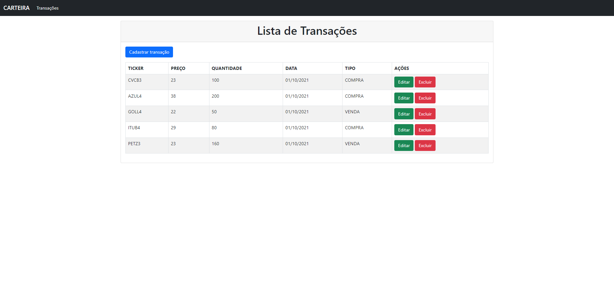
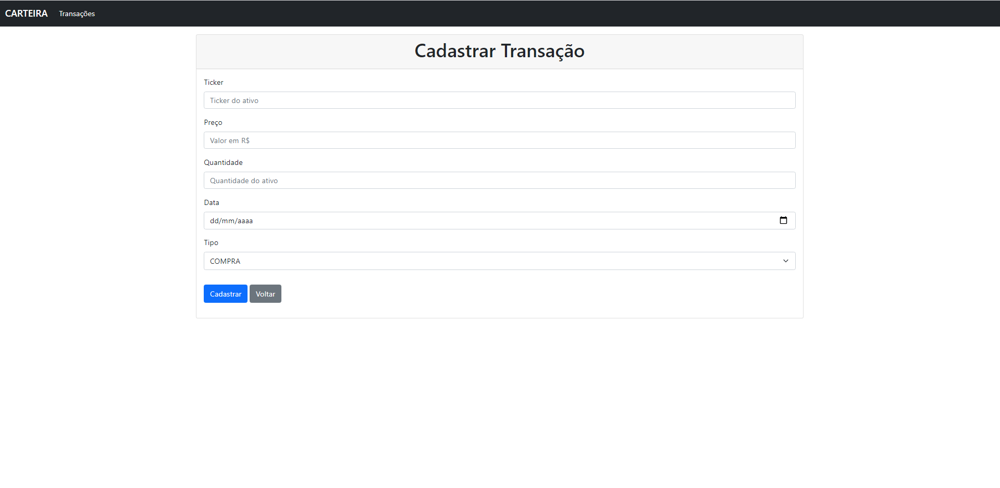
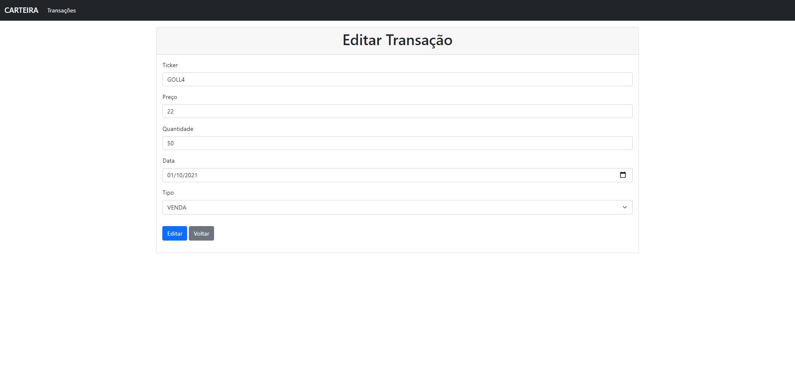

<h1 align="center">
  
</h1>

# :computer: carteira
CRUD em Java utilizando Servlet, JSP e JDBC.

Este projeto foi desenvolvido no Módulo 1 do Bootcamp Java Alura 2021.

### :hourglass: Status do projeto
Concluído.

### :hammer_and_wrench: Tecnologias

As seguintes tecnologias e ferramentas foram utilizadas no desenvolvimento deste projeto:

- [Java](https://www.oracle.com/java/)
- [Servlet](https://www.oracle.com/java/technologies/java-servlet-tec.html)
- [JSP (JavaServer Pages)](https://www.oracle.com/java/technologies/jspt.html)
- [JSTL (JavaServer Pages Standard Tag Library)](https://www.oracle.com/java/technologies/java-server-tag-library.html)
- [JDBC (Java Database Connectivity)](https://docs.oracle.com/javase/8/docs/technotes/guides/jdbc/)
- [Bootstrap](https://getbootstrap.com/)
- [Apache Tomcat](http://tomcat.apache.org/)
- [MySQL](https://www.mysql.com/)
- [Maven](https://maven.apache.org/)
- [Git](https://git-scm.com/)
- [Docker](https://www.docker.com/)

### :page_with_curl: Features
- [x] Cadastro de transações
- [x] Listagem de transações
- [x] Edição de transações
- [x] Exclusão de transações

### :pencil: Pré-requisitos

Antes de começar, você precisa ter instalado em sua máquina as seguintes ferramentas:
- [Git](https://git-scm.com/)
- [Docker](https://www.docker.com/)

### :rocket: Executando a aplicação

```bash
# Clone este repositório
$ git clone https://github.com/antonioeloy/carteira.git

# Execute os contêineres da aplicação
$ docker-compose up

# Acesse o seguinte endereço no navegador
$ http://localhost:8080/carteira/transacoes
```

### :gear: Testando a aplicação

A aplicação permite realizar um CRUD de transações, conforme imagens a seguir:

<h1 align="center">
  
</h1>

<h1 align="center">
  
</h1>

<h1 align="center">
  
</h1>

### :copyright: Licença

Este projeto está licenciado nos termos da licença MIT.
